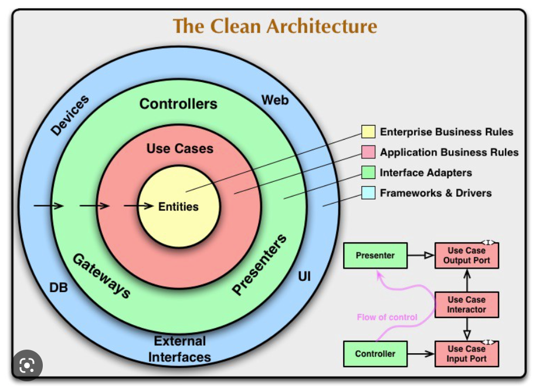
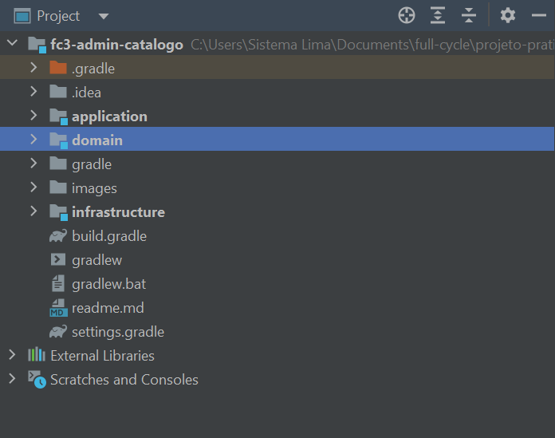
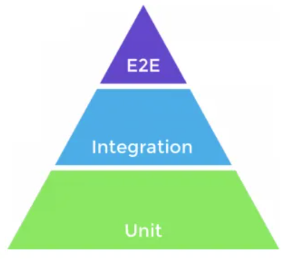

# Arquitetura da aplicação com Clean Architecture



## Conceito

* Receber e separar tudo que é dominio e caso de uso, do que é infraestrutura
* Desacoplar framework do nosso caso de uso e do dominio, permitindo que o framework seja apenas um detalhe, onde se prescisarmos mudar o framework basta apenas ajustar a infra.

## Screaming Architecture



* Organizar as pastas para que elas digam o que representam
* Separado em treis modulos, para não ter um acoplamento de framework e bibliotecas
* Domain não conhece a Aplication
* Aplication conhece apenas o Domain
* Infrastructure conhece o Domain e a Aplication

## TDD e piramide de testes



* Testes unitarios (rapidos)
* Testes de integração (lento)
* E2E (muito lento)


## Unit

* São testes que verificam unitariamente o funcionamento de determinada parte do codigo, independente se há ou não integração
* O teste unitario será sempre definido como a menor parte testavel do seu projeto, pode ser um metodo de uma classe, uma função, etc.
* São extremamente rápido por não depender de framework e é os testes que mais encontramos na aplicação
* Utilizar JUnit

## Integration

* O intuito desse teste e verificar se duas ou mais unidades que se interagem estão funcionando como esperado
* Geralmente utilizado para testar isoladamente algumas funcionalidades do sistema integrado ao framework. 
* Econtrarar muitos testes integrados na camada de infraestrutura da aplicação.

## Exemplos de testes integrados

* Verificar se o framework está fazendo o bind da requisição corretamente.
* Verificar se os repositorios estão fazendo as queries corretamente
* Verificar as chamadas HTTP estão sendo feitas corretamente

## E2E

* São testes que simulam o usuario no ambiente real, ou seja, simula todo o processo de um usuario abrindo o navegador, preenchendo os formularios, enviando requisiçoes para o servidor, etc.
* No contexto de uma API (microsserviço), utilizaremos a nomeclatura E2E para os testes que sobem toda a aplicação e simulam o usuario a partir de chamadas nos endpoints.


## Setup do Projeto

* Microsserviço: fc3-admin-catalogo
* Linguagem de programação: Java
* Tecnologia: Spring Boot 2.6.13
* Gerenciador de dependência: Gradle / Groovy
* Java 17
* IDE IntelJ
* 
## GitHub

* create a new repository on the command line
```
echo "# projeto-pratico-Java-Backend-Full-Cycle" >> README.md
git init
git add README.md
git commit -m "first commit"
git branch -M main
git remote add origin https://github.com/wagnersistemalima/projeto-pratico-Java-Backend-Full-Cycle.git
git push -u origin main

```
* push an existing repository from the command line

```
git remote add origin https://github.com/wagnersistemalima/projeto-pratico-Java-Backend-Full-Cycle.git
git branch -M main
git push -u origin main

```
## Modulo 1

* Seguindo o DDD, respeitando os agregados, valueoObjects, gateway separado, nomenclatura mais expressiva, criar e modelar toda a Categoria sem se preucupar com: Banco de dados, informaçoes de web request.
* Criar o Dominio com as interfaces, casos de uso
* Focar na regra de negocio e no dominio
* Deixar os detalhes para outro modulo, como configuração de banco de dados exemplo